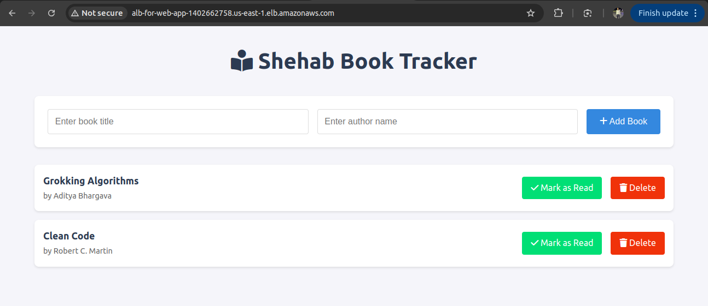

# Book Tracker Application

## Architecture



## Application


The **Book Tracker Application** is a cloud-native, two-tier app built to help you manage your reading list with ease. It follows industry best practices, featuring a modern, responsive UI and a solid backend architecture.

This repository is a **hands-on playground** for cloud and DevOps enthusiasts, offering practical experience in containerization, configuration management, and continuous delivery workflows — all implemented with best practices in mind.

---

## Tech Stack

- **Frontend**: HTML, CSS, JavaScript (AJAX)
- **Backend**: Flask (Python)
- **Database**: MySQL
- **Infrastructure**: AWS (EC2, ALB, S3, RDS, VPC, Security Groups)
- **Automation**: Terraform, Ansible (with dynamic inventory using `boto3`)
- **CI/CD**: Jenkins
- **Containerization**: Docker, Docker Compose
- **Secrets Management**: AWS SSM Parameters

---


## Deployment Methods

### 1. Deploy on AWS (Recommended)

This method leverages Terraform for infrastructure provisioning, Ansible for configuration management, and Jenkins for CI/CD pipeline automation.

#### Steps:
1. Clone the repository:
   ```bash
   git clone https://github.com/shehab-19/two-tier-dev.git
   cd two-tier-dev
   ```

2. Update the Terraform configuration:
   - Modify the key pairs, database secrets, and IPs in the Terraform files located in the `two-tier-infra/` directory.
   - Create your own SSM parameters for storing sensitive data like database credentials.

3. Initialize and apply Terraform:
   ```bash
   terraform init
   terraform apply -auto-approve
   ```

4. Track and dynamically manage inventory:
   - Use the `boto3` integration in `inventory-bastion.aws_ec2.yaml` to dynamically fetch and manage the bastion host and application instances.

5. Deploy using Ansible:
   ```bash
   ansible-playbook -i inventory-bastion.aws_ec2.yaml deployment-playbook.yaml -vv
   ```

6. Access the application:
   - Use the DNS of your Application Load Balancer (ALB) to access the app.

7. Cleanup AWS Resources
    ```bash
    terraform destroy -auto-approve
    ```
---

### 2. Deploy Locally

This method is ideal for testing and development purposes.

#### Steps:
1. Clone the repository:
   ```bash
   git clone https://github.com/shehab-19/two-tier-dev.git
   cd two-tier-dev
   ```

2. Install dependencies:
   ```bash
   pip install flask flask-mysqldb python-dotenv
   ```

3. Copy `.env.example` to `.env` and update it with your MySQL credentials:
   ```bash
   cp .env.example .env
   ```

4. Create a MySQL database named `bookstore` (or your chosen name).

5. Run the application:
   ```bash
   python app.py
   ```

6. Visit `http://localhost:5000` in your browser.

---

### 3. Deploy Using Docker

This method simplifies deployment using containerization.

#### Steps:
1. Clone the repository:
   ```bash
   git clone https://github.com/shehab-19/two-tier-dev.git
   cd two-tier-dev
   ```

2. Copy `.env.example` to `.env` and update it with your MySQL credentials:
   ```bash
   cp .env.example .env
   ```

3. Build and run the application using Docker Compose:
   ```bash
   docker-compose up -d
   ```

4. Access the application:
   - Visit `http://localhost:5000` in your browser.

---

## Project Structure

- `app.py`: Main Flask application
- `templates/`: HTML templates
- `static/`: Static assets (CSS, JS)
- `.env`: Configuration (create from `.env.example`)
- `two-tier-infra/`: Terraform configuration for AWS deployment
- `ansible-config/`: Ansible configuration files
- `deployment-playbook.yaml`: Ansible playbook for deployment
- `inventory-bastion.aws_ec2.yaml`: Dynamic inventory configuration using `boto3`
- `Jenkinsfile`: CI/CD pipeline definition

---

## Contributors

- **GitHub**: [Shehab Ahmed](https://github.com/shehab-19)
- **LinkedIn**: [Shehab Ahmed](https://www.linkedin.com/in/shehab-ahmed-164bbb244/)